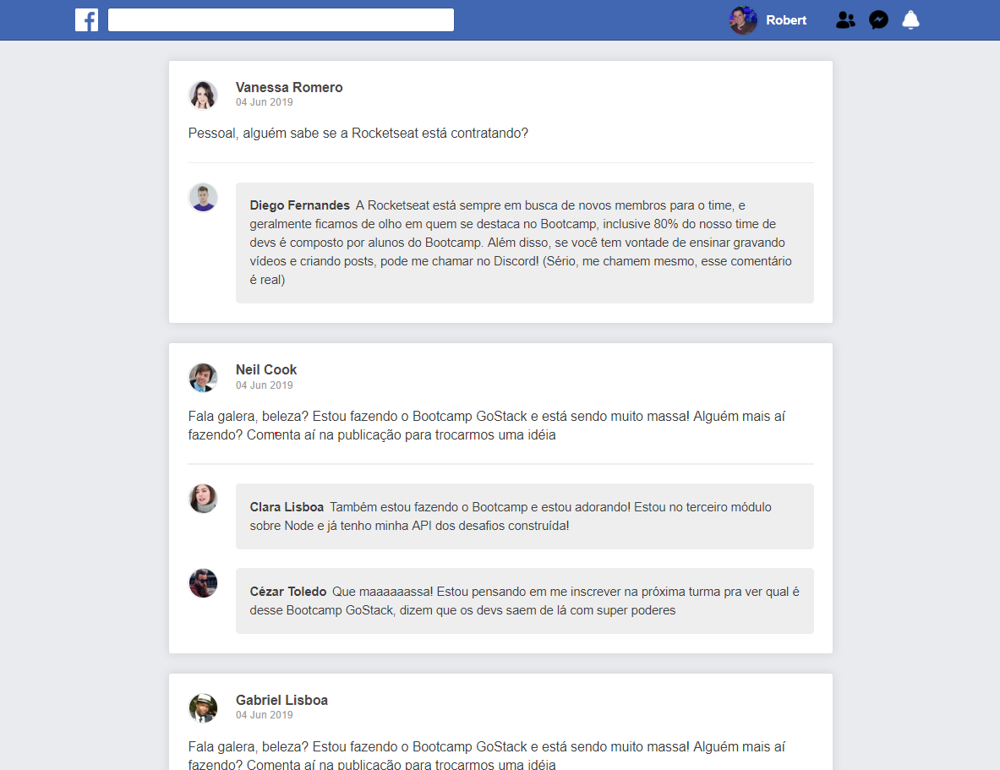

# Simple React JS app

This is a simple React JS app just to render a static template of a facebook timline.



### Run the app

##### 1) Install dependencies

```
yarn
```

##### 2) Run the server

```
yarn dev
```

##### 3) Open the url `http://localhost:8080/`
